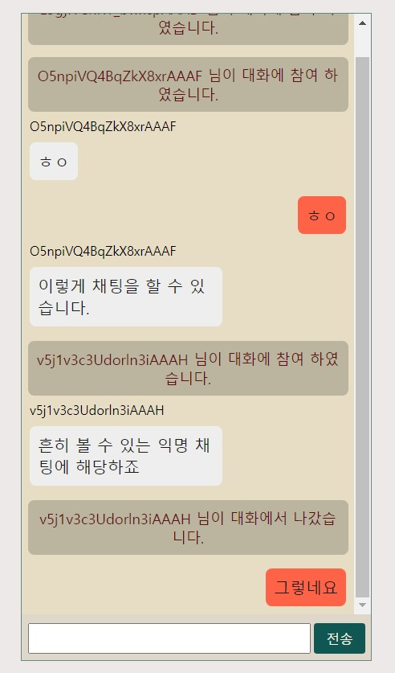

# react-tomato-talk

`react`와 `socket.io`, `socket.io-client`을 통해서 만든 익명 채팅 모듈입니다.  
소켓 통신을 통한 실시간 익명 채팅 기능을 웹컴포넌트 방식으로 제공하여서 기존의 사이트나  
다양한 레이아웃에 쉽게 접목 시킬 수 있도록 하기 위한 오픈소스 프로젝트입니다.  
현재는 간단한 *n:n 익명 채팅* 기능을 제공하고 있으며 추가적인 기능 및 설정을 지속적으로 업데이트 할 예정이니 자세한 내용은 아래의 업데이트 기록을 확인 해보시길 바랍니다.  
``기본적으로 해당 컴포넌트는 flex 반응형 레이아웃으로 구성 되어 있습니다.``  
``프론트엔드 패키지외에도 따로 socket.io 또는 sockjs으로 구성된 채팅 서버가 필요합니다.``  

## 데모 버전

  
[토마토톡데모](https://yoonjonglyu.github.io/webChat/)

**링크를 통해서 확인 가능한 데모 버전의 채팅창 부분을 모듈화한게 본 패키지입니다.**  
**데모 버전의 경우 개발 중인 기능이 포함 되어 있을 수 있으니 참고하시길 바랍니다.**  

## 설치

```bash
npm npm i react-tomato-talk
//or
yarn add react-tomato-talk
```

## 사용법

### 프론트 엔드

```js
import React from 'react';
import ReactTomatoTalk from 'react-tomato-talk';

const App = function () {
    return (
        <main>
            채팅창
            <section
                className="container"
                style={{
                    display: "flex", // tomatoTalk 컴포넌트는 flex 레이아웃으로 이루어져 있습니다.
                    flex: "1",
                    maxWidth: "350px", // maxWidth를 통해서 채팅창 가로너비를 반응형으로 지정해줄 수 있습니다.
                    maxHeight: "645px" // height를 통해서 채팅창 높이를 지정해줄 수 있습니다.
                }}
            >
                <ReactTomatoTalk
                    url={'http://localhost:3000/'} //소켓서버 url입니다.
                />
            </section>
        </main>
    );
};
```

### 벡엔드

> 해당 모듈을 위해서 현재 필요한 소켓 이벤트는 connection, join, send, leave, disconnect가 있다.  
> 기능 추가에 따라서 벡엔드 로직이 추가되거나 일부 수정 될수 있으므로 업데이트시 확인바랍니다.

```js
const { Server } = require("socket.io"); // cors 설정 주의.
const io = new Server({
    transports: ["websocket"] // 현재는 웹소켓 방식만 지원해준다.
});

const usrList = {}; // 사용자가 들어간 채팅방을 기록하는 객체;
io.on("connection", (client) => {
    client.on('join', data => { // {socketIdx, room} 해당 유저 식별키와 어떤 방에 갈지를 받는다.
        io.socketsJoin(data.room); // 해당 채팅방에 join
        usrList[data.socketIdx] = data.room; // 해당 유저가 어느 방에 들어갔는지 기록
        io.to(data.room).emit('joinRoom', data.socketIdx); // 해당 채팅방에 대화참여 메시지 전송
    });
    client.on('send', data => { // {message, socketIdx, room} 사용자가 보낸 메시지를 받아서 해당 채팅방에 전송
        io.to(data.room).emit('receive', {
            message: data.message,
            idx: data.socketIdx
        });
    });
    client.on('leave', data => { // {socketIdx, room} 해당 유저 식별키와 어떤 방에서 나올지를 받는다.
        io.socketsLeave(data.room); // room에서 벗어난다.
        delete usrList[data.socketIdx]; // 해당유저가 채팅방에서 벗어남을 기록
        io.to(data.room).emit('leaveRoom', data.socketIdx); // 대화 이탈 메시지 전송
    });
    client.on('disconnect', () => { // 연결해제시 채팅서버에 기록된 해당 유저의 채팅방에 이탈 메시지 전송
        io.to(this.usrList[client.id]).emit('leaveRoom', client.id); // 대화이탈에 대한 메시지 전송
        delete usrList[client.id]; // 메모리에서 해당 유저의 데이터 삭제
    });
});

io.listen(3000);
```

### Props

1. **`url(string)`** : 소켓서버의 url입니다. 
  
### 업데이트
- 1.1.0
  - 초기 버전 배포.
- 1.2.0
  - 서버 연결 상태 관련 UI 추가: 연결중, 연결해제 및 실패.
- 1.2.1
  -  패키지 제공 방식이 커스텀훅 => 고차컴포넌트로 변경.


### LICENSE

react-daumpost-hook is [MIT licensed](./LICENSE).